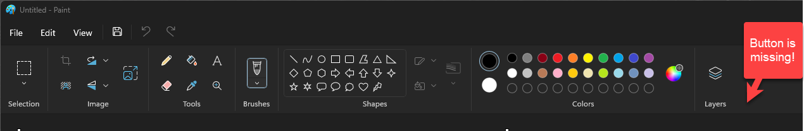
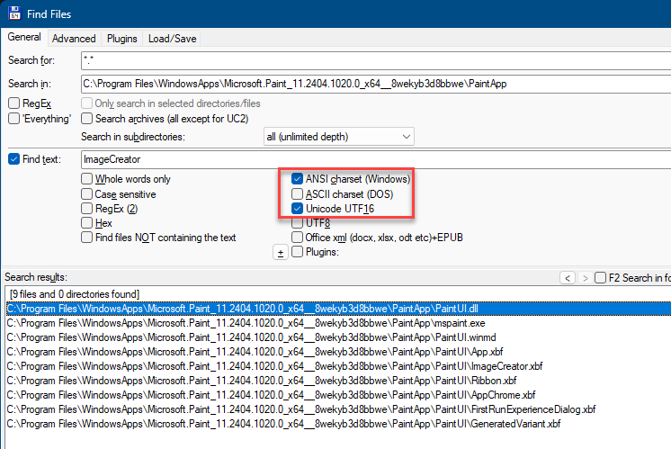
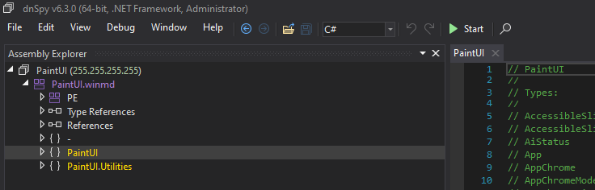
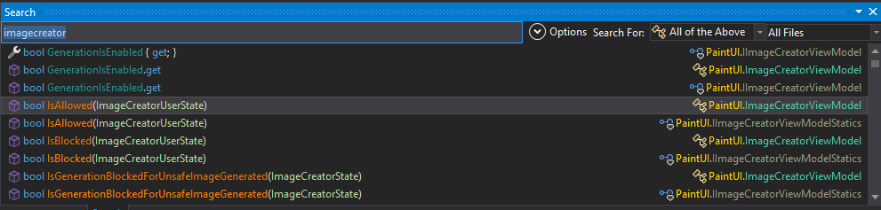
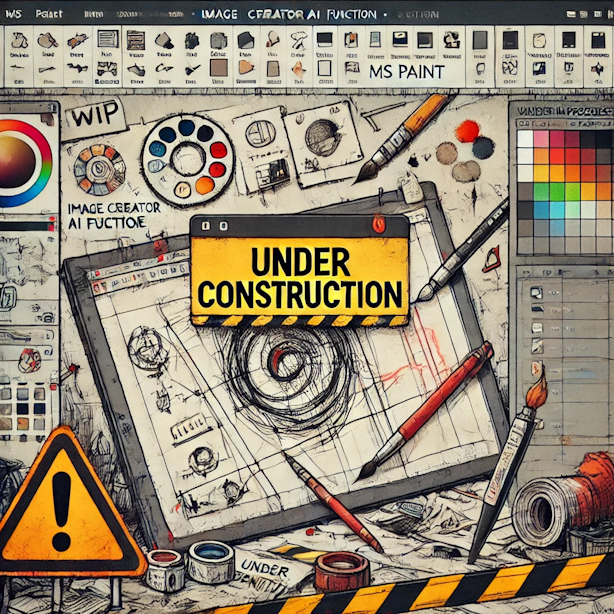

# EnableImageCreator
PowerShell Script to enable Image Creator option in the new Microsoft Paint (MSPaint)

After reading this Microsoft article, [Use Image Creator in Paint to generate AI art](https://support.microsoft.com/en-us/windows/use-image-creator-in-paint-to-generate-ai-art-107a2b3a-62ea-41f5-a638-7bc6e6ea718f) I was curious to have a look at the new and fancy Ai Image Creator tool in Microsoft Paint.

According to the article there should be a Image Creator button in the Ribbon like this:

However my paint lacked the button:

To be fair to Microsoft the article mentions: Image Creator is currently available only in the following regions – United States, France, UK, Australia, Canada, Italy and Germany.

So how do we enable it if your region isn't in that list?

The obvious thing to look for is, how does mspaint.exe determine my region? It must call into some API to determine this.
So we must figure out which one...

Using my favourite tool, Total Commander, I searched all files in the MSPaint folder for `Image Creator` which of course yielded many results.
I therefore searched for `ImageCreator`, a more logical name for classes, methods or properties to be used. This yielded the following results:

This seemed useful as likely either mspaint.exe or even more likely, judging by the name, `PaintUI.dll` would have the region check.
I decided to ignore `.xbf` files for now as they are likely data files (most likely _XAML Binary Format_).

However there was also an `.WinMD` file and when I googled that I learned it's used for Language Projection.
This feature is described on MSDN, (Windows Metadata [WinMD) files)](https://learn.microsoft.com/en-us/uwp/winrt-cref/winmd-files)
>Windows Runtime (WinRT) APIs are described in machine-readable metadata files with the extension .winmd (also known as Windows Metadata). These metadata files are used by tools and language projections in order to enable language projection.

Then I read the following:

>WinMD files use the same physical file format as Common Language Runtime (CLR) assemblies, as defined by the ECMA-335 specification

Very interesting as this means we can possibly read .WinMD files with .NET decompilcation tools.
So I decided to attempt to read the file `PaintUI.winmd` with dnSpyEx.

And *eureka* we can indeed read `.WinMD` files with dnSpyEx!

Then I used the search option in dnSpyEx and searched for `ImageCreator`:

So that makes it clear that the region check is inside `PaintUI.dll` 

Note, this readme file is not yet finished so please come back later, or if you cannot wait then download the PowerShell script that enables Image Creator [here](EnableImageCreator.ps1).

